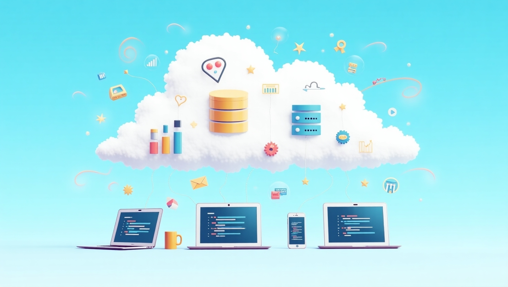

# Holiday Task Management Lab

Welcome to the **Holiday Task Management Lab**! This project is designed as a hands-on training lab to help you learn how to build and deploy a modern, serverless application on AWS using the AWS Cloud Development Kit (CDK) in Python.

## Project Overview

This lab guides you through the creation of a cloud-native task management system for managing holiday-related tasks. The system allows administrators to assign tasks to users, set deadlines, and notify users via email and push notifications. Users can view and update their assigned tasks. The project demonstrates best practices in serverless architecture, authentication, and event-driven notifications.

## Main Features

- **User Authentication & Authorization:**
  - AWS Cognito User Pools for user management (admin/member roles)
  - Secure API access with Cognito authorizer
- **Task Management API:**
  - Create, view, and update tasks via RESTful endpoints (API Gateway)
  - Role-based access (admins assign, members update their own)
- **Serverless Compute:**
  - AWS Lambda functions for all backend logic (task CRUD, user listing, deadline checks)
- **Persistent Storage:**
  - DynamoDB table for storing tasks
- **Notifications:**
  - Email notifications via Amazon SES when tasks are assigned
  - Push notifications via Amazon SNS when task status changes
- **Scheduled Checks:**
  - Lambda function triggered by EventBridge to check for upcoming deadlines
- **Infrastructure as Code:**
  - Entire stack defined and deployed using AWS CDK (Python)

## Architecture Diagram

Below is a high-level architecture diagram of the solution:



## Technology Stack

- **AWS CDK (Python):** Infrastructure as code
- **AWS Lambda:** Serverless compute
- **Amazon API Gateway:** REST API endpoints
- **Amazon Cognito:** Authentication and user management
- **Amazon DynamoDB:** NoSQL database for tasks
- **Amazon SNS & SES:** Notifications (push and email)
- **Amazon EventBridge:** Scheduled events for deadline checks

## Getting Started

1. **Clone the repository and set up your Python virtual environment:**
   ```bash
   python3 -m venv .venv
   source .venv/bin/activate
   pip install -r requirements.txt
   ```
2. **Deploy the stack:**
   ```bash
   cdk deploy
   ```
3. **Explore the API:**
   - Use the output API endpoint to interact with the system (see CloudFormation outputs after deploy)
   - Authenticate using Cognito (admin/member roles)

## Lab Learning Objectives

- Understand how to build a secure, serverless API on AWS
- Learn to use AWS CDK for infrastructure automation
- Practice integrating Lambda, API Gateway, Cognito, DynamoDB, SNS, and SES
- Gain experience with event-driven architectures and scheduled tasks

## Useful Commands

- `cdk synth` – Synthesize the CloudFormation template
- `cdk deploy` – Deploy the stack to AWS
- `cdk diff` – Compare deployed stack with local changes
- `cdk destroy` – Remove the stack from your AWS account

---

Enjoy your learning journey with the Holiday Task Management Lab!
